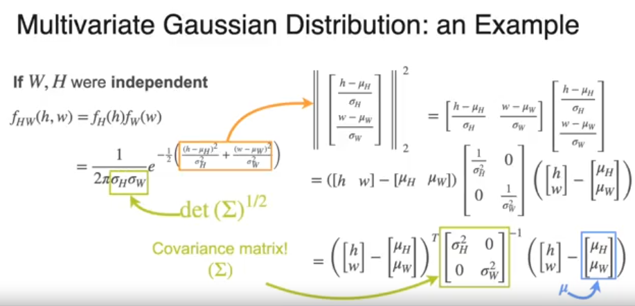
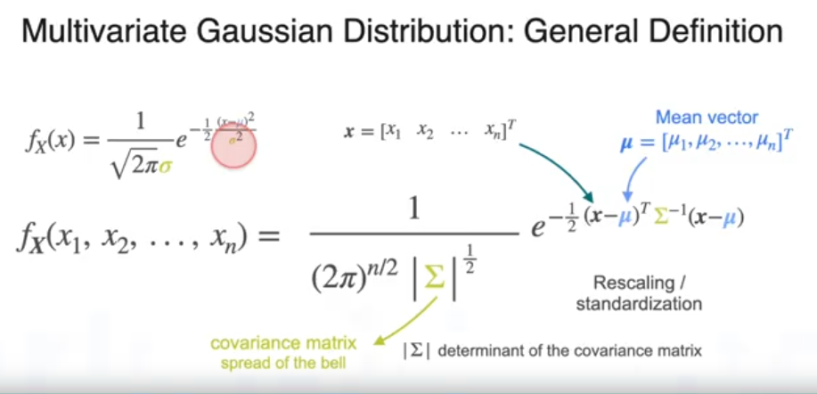
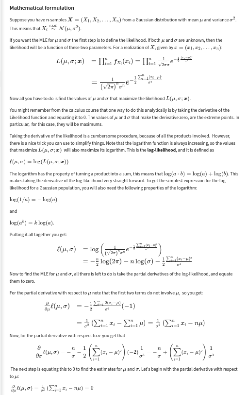
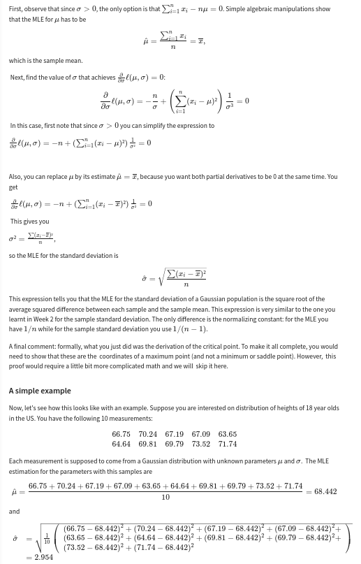

# **Mathematics for Machine Learning**

Important mathematical concepts refresher for ML.

## **Linear Algebra**

https://www.deeplearningbook.org/contents/linear_algebra.html

[Linear Algebra](linear-algebra.md)

## **Numerical Computations and Optimization**

https://www.deeplearningbook.org/contents/numerical.html

[Numerical Computations](numerical-computations.md)

## **Probability and Information Theory**

https://www.deeplearningbook.org/contents/prob.html

Multivariate Gaussian:

Only valid for independent variables:

General definition:

MLE (Maximum Likelihood Estimator):

