<hr/>

### Singular vs Non-singular systems and determinant

<hr/>

1. Singular vs Non-singular systems of equation/matrix. Each equation in the system is a row vector in the matrix representing the sytem. If the system has no solution or infinitely many solutions it's called a singular system/matrix. A singular system has linearly dependent equations (i.e. row vectors are linear combinations of one another).
2. Determinant of a matrix: diag(X) - anti-diag(X) = 0, then matrix is singular. For a NxN matrix, products of all diagonals to the right - products of all diagonals to the left. The diagonals wrap around. For example:

```
A =
[
    [1, 1, 1],
    [3, 2, 1],
    [4, 5, 2]
]

i.e. the upper right diagonal 1 wraps around to 3 and 5, the upper diagonal 1,1 wraps around to 4.

det(A) = [1 * 2 * 2 + 1 * 1 * 4 + 1 * 3 * 5] - [1 * 2 * 4 + 3 * 5 * 1 + 4 * 1 * 1] = [4 + 4 + 15] - [8 + 15 + 4] = 31 - 27 = 4

OR

| a b c |
| d e f |
| g h i |

a * [(e,f), (h,i)] -b * [(d,f), (g,i)] + c * [(d,e), (g,h)]
```

Upper triangular matrices (i.e. bottom triangle is all 0s) have det(A) = diag(A)

Operations that do not change singularity:

- Multiplying a row by a nonzero scalar.
- Adding a row to another row.
- Switching rows.

<hr/>

### Upper triangular, lower triangular, and echelon form matrices

<hr/>

A rectangular matrix is in echelor form (or row echelon form) if it has the following 3 properties:

1. All nonzero rows are above any rows of all zeros.
2. Each leading entry of a row (also called pivot) is in a column to the right of the leading entry of the row above it. (i.e. first non-zero entry if any).
3. All entries in a column below a leading entry are zeros.

If a matrix in echelon form satisfies the following additional conditions, then it is in reduced echelon form (or reduced row echelon form):

4. The leading entry in each nonzero row is 1.
5. Each leading 1 is the only nonzero entry in its column.

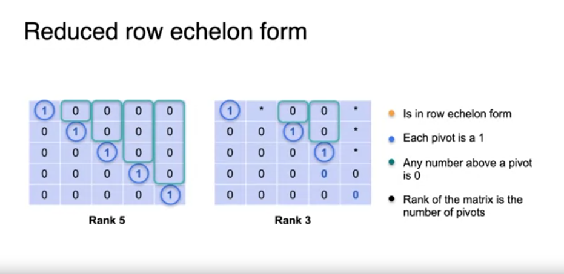

Row echelon form (diagonal can be 1s or 0s)

```
[
(1 * * * *)
(0 1 * * *)
(0 0 0 0 0)
(0 0 0 0 0)
(0 0 0 0 0)
]
```

```
Echelon form, but not triangular because not a squared matrix:

[
(1, 2, 3)
(0, 4, 5)
]

Triangular, but not echelon (because the leading entry 5 is not to the right of leading entry 4):

[
(1, 2, 3)
(0, 0, 4)
(0, 0, 5)
]

[
(5,1)
(4,-3)
]

==> to row-echelon form (upper diagonal matrix)

[
(1,0.2)
(0,1)
]

==> to reduced row-echelon form
[
(1,0)
(0,1)
]
```

<hr/>

### Rank of a matriex

<hr/>

In machine learning used for image compression.
Singular Value Decomposition (SVD) changes the rank of a matrix while modifying it as little as possible.

`Rank = N - (Dimension of solution space)`

For example, a non-singular matrix has 1 point as the solution so the solution space is 0.
For a 5x5 matrix we have 5 linearly independet equations so the rank of the matrix would be Rank(A) = 5 - 0 = 5.
For a singular matrix with infinite solutions we have a line which has solution space = 1 or solution space = 2 if the infinitely many solutions span a plane (or higher dimensions depending on the dimensions of the matrix).

A matrix is non-singular only if it has `Full Rank (Rank = number of rows/number of equations)`. This means that the system carries the max amount of information possible (each equation is linearly independent).

The rank is the largest number of linearly independent rows/columns in the matrix.
The relation between rank and row-echelon form matrices is the count of 1s in the diagonal of the matrix.
For example, for a 2x2 matrix:

- Matrix in row-echelon form with rank 2 (non-singular)
  1 0.2
  0 1

- Matrix in row-echelon form with rank 1 (singular)
  1 0.2
  0 0

- Matrix in row-echelon form with rank 0 (singular)
  0 0
  0 0

So rank of a matrix is the number of pivots (non-zero leading entries in a row) for the row-echelon form of the matrix.

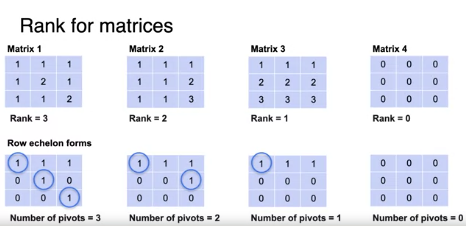

<hr/>

### Vectors, Linear transformations

<hr/>

L1-norm: `|(a,b)| = |a| + |b|`.

L2-norm: `|(a,b)| = sqrt(pow(a,2) + pow(b,2))`.

Generally, Lp-norm of a vector x is:

`||x|| = pow( sum( pow(|x[i]|,p) ), 1/p )`

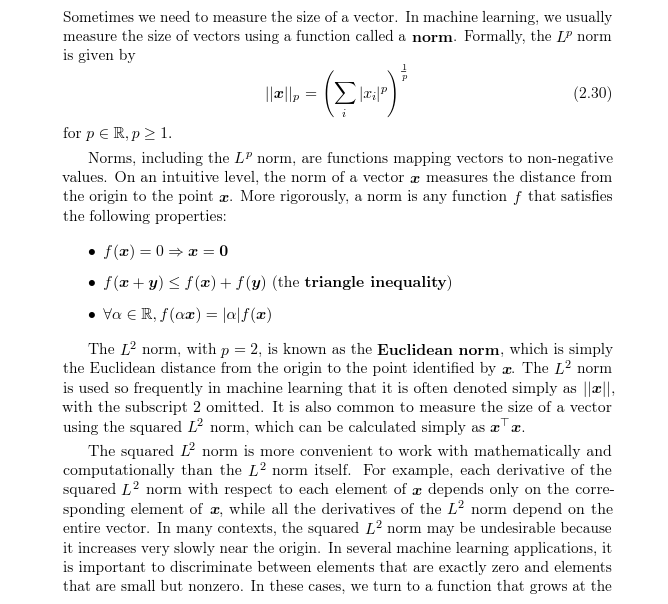

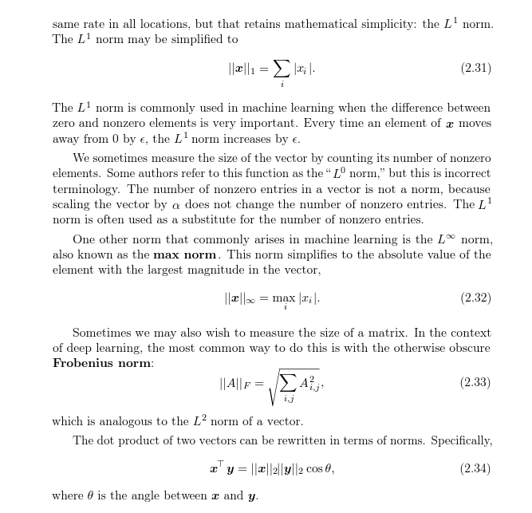

Norms are useful to know the distance between vectors. In machine learning this is used to get similarities between datapoints expressed by n-features in an n-dimensional space.

Norm of a vector using the dot-product of the vector with itself: `L2-norm = sqrt(dotprod(u, u))`
Two vectors are `orthogonal` if `dotprod(u,v) = 0`.
If we have two vectors, u and v, we can project a vector on the other and compute the dotproduct with the projection (u' or v'): `dotprod(u,v) = |u'| * |v|`.

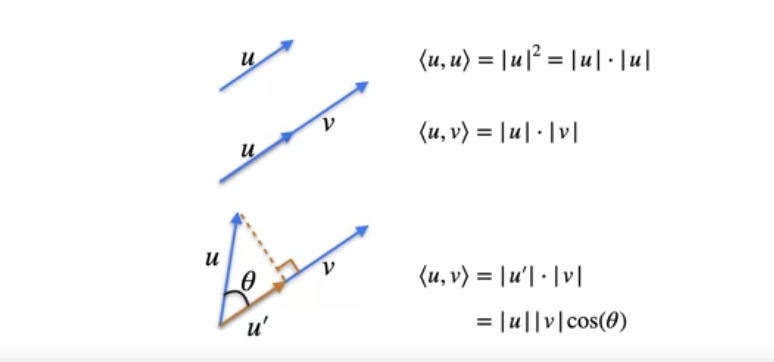

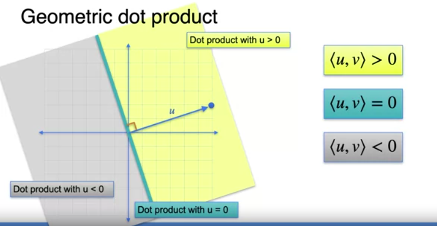

Linear transformations can be seen as matrices (functions) that map vectors to another plane.
For example:

```
Matrix:
(3,1)
(1,2)

Vectors: (0,0) (1,0) (0,1) (1,1)

If we take the dot product of the column vectors and the matrix we get the following new vectors:
(0,0) (3,1) (1,2) (4,3)
```

Linear tranformations are a change of coordinates (basis) after applying the matrix (function) mapping.
If we have the linear transformations (i.e. the N points in the first R^N mapped to the second R^N) then we can do the inverse operation and find the matrix that produces that linear transformation. For example, in R^2 we just need the vector (0,1) and (1,0) and the corresponding mappings (i.e. (2,3) and (3,-1)) to get to the matrix (i.e. [(3,2),(-1,3)] by taking the dotproduct with (1,0) and (0,1)).

Matrix multiplication can be also seen as combining 2 linear transformations into a 3rd one.
The first linear transformation to map to the second R^2 and the second linear transformation to map to the third R^2 gives us the two matrices to multiply to get the third linear transformation to map the first R^2 to the third R^2.
Since in the first R^2 we have the column vectors (1,0) and (0,1), the resulting column vectors in the third R^2 are the two column vectors of the product matrix. The two operands (matrices) need to be switched to get to the product matrix with this linear transformation (i.e linear_transform_2 \* linear_transform_1 = linear_transform_3) as matrix multiplication is not commutative.

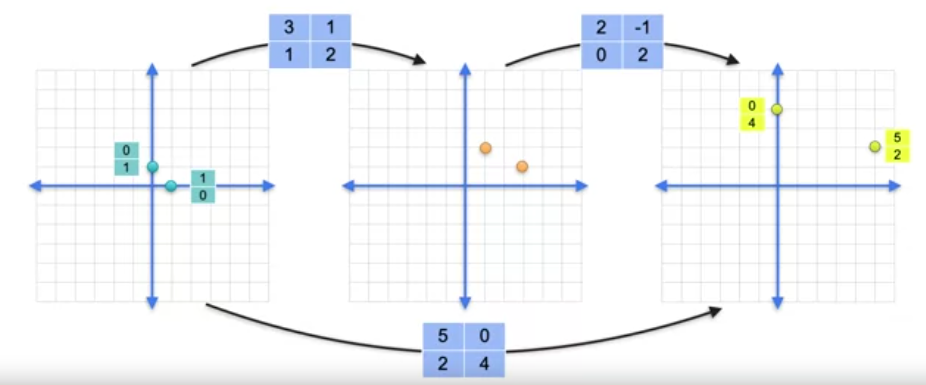
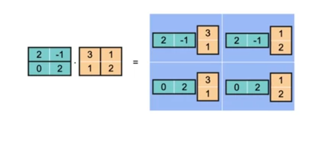

`The Identity Matrix (I)` is the matrix that when applied as a linear transformation it does not alter the resulting R^N basis.
The resulting vector is the same as the starting vector when multiplied by I.

`The Inverse Matrix`:

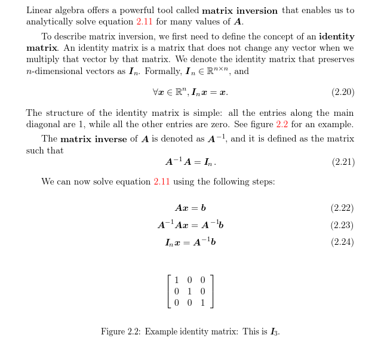
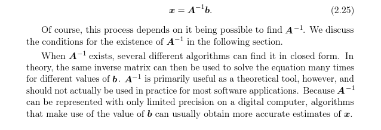

We can find the Inverse Matrix by solving the system of equations where the resulting column vectors are (1,0) and (0,1) (i.e. the second linear transformation results in the basis to be the same as the initial one).

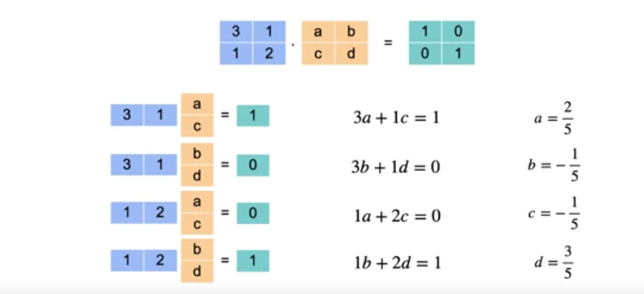

Non-singular matrices ALWAYS have an Inverse Matrix. Singular matrices do NOT (Non-invertible).
