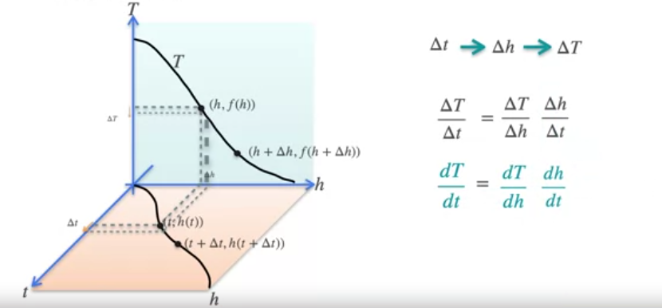
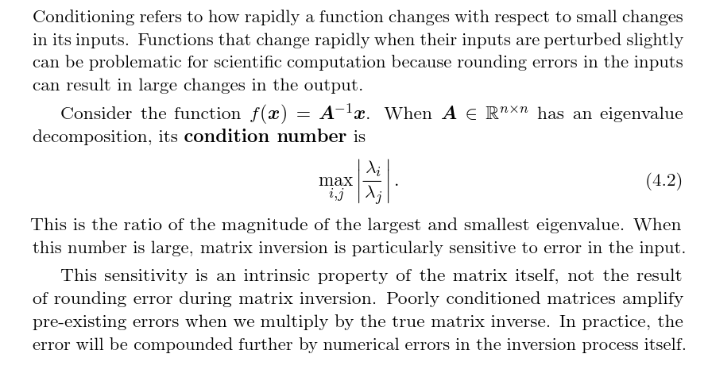
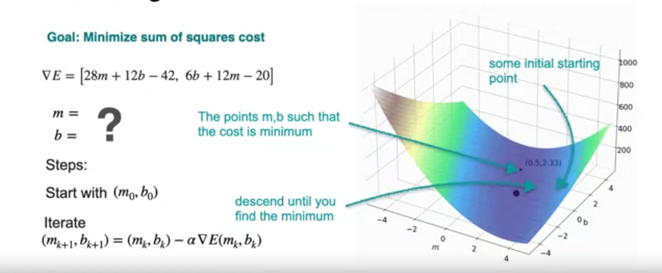
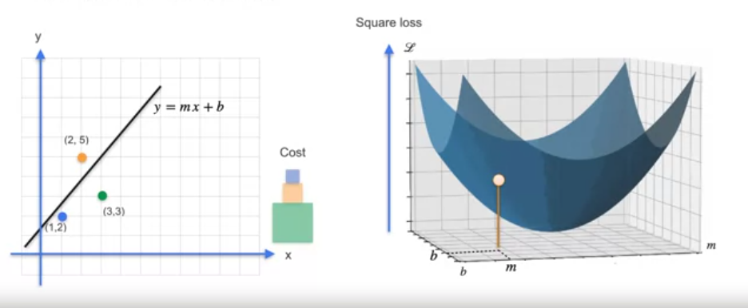
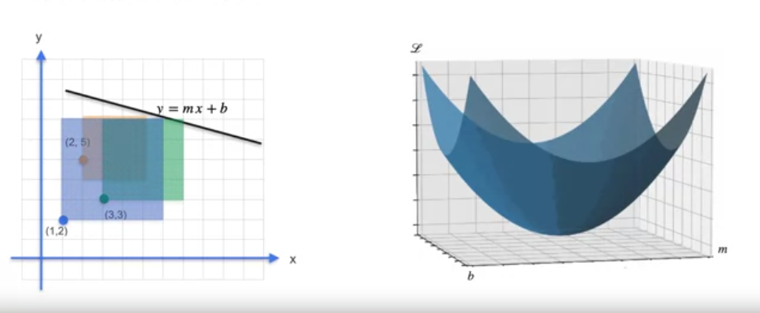
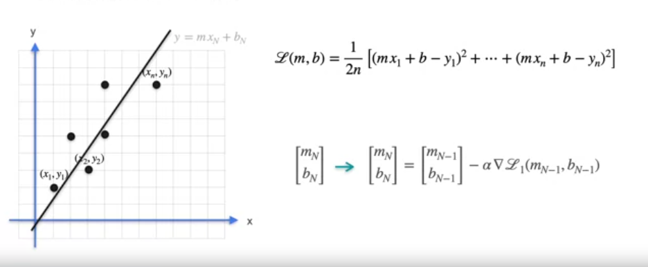

### Refresh

1. Derivative of the inverse function: The derivative of the inverse of f at argument x is the reciprocal of the derivative of f at argument f(x).

2. Null-space (kernel) of matrix A: `Ax = 0`, linear combinations of vector(s) x where the resulting vector after applying the linear transformation (A) is the 0 vector.

3. Non-differentiable: cusps, non-continous functions, vertical tangents (i.e. parallel to y axis since slope is infinite)

4. Multiplication by scalar yields `c * f(x) = c * f'(x)`

5. `f(x) = g(x) + h(x) => f'(x) = g'(x) + h'(x)`

6. `f(x) = g(x) * h(x) => f'(x) = g'(x) * h(x) + g(x) + h'(x)`

7. `d/dt g(h(t)) = dg/dh * dh/dt`, chain rule. With 3 or more: `d/dt f(g(h(t))) = df/dg * dg/dh * dh/dt`

### Poor conditioning

### Optimization

1. Mean Squared Loss (MSE)

2. Mean Absolute Loss (MAE)

3. Log Loss:

- finding the maximum of a f(x) is the same as finding maximum of log(f(x)).
- taking the log makes the differentiation easier because we can split the composition of functions in sums rather than having to take the derivative of products (harder than sums to differentiate).
- the product of small numbers is a very small number and makes it difficult to represent digitally with floating point precision.

4. Gradient `∇f(x) = (df/dx[1], ..., df/dx[n]), column vector`. Minimize/Maximize functions of N-variables similar to how derivative minimizes/maximizes functions of 1 variable. All slopes of tangent lines given by partial derivatives = 0, then maximum/minimum (local or global depending on the function).

5. Gradient descent

- Example minimizing MSE with numerical methods (gradient descent) instead of analytically (i.e. solving system of equation given by the two partial derivatives (gradient)).

